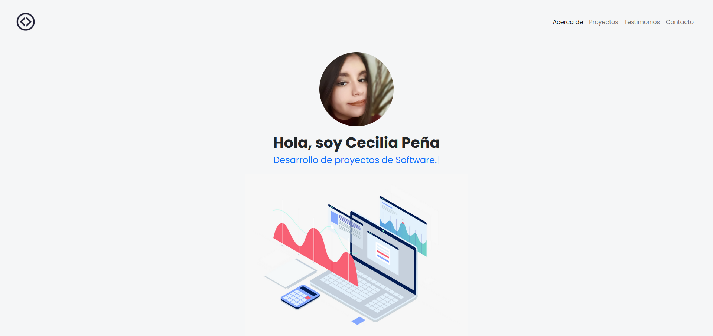
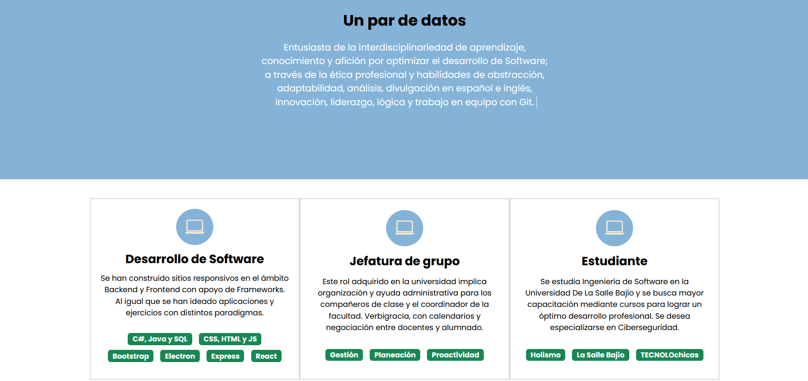
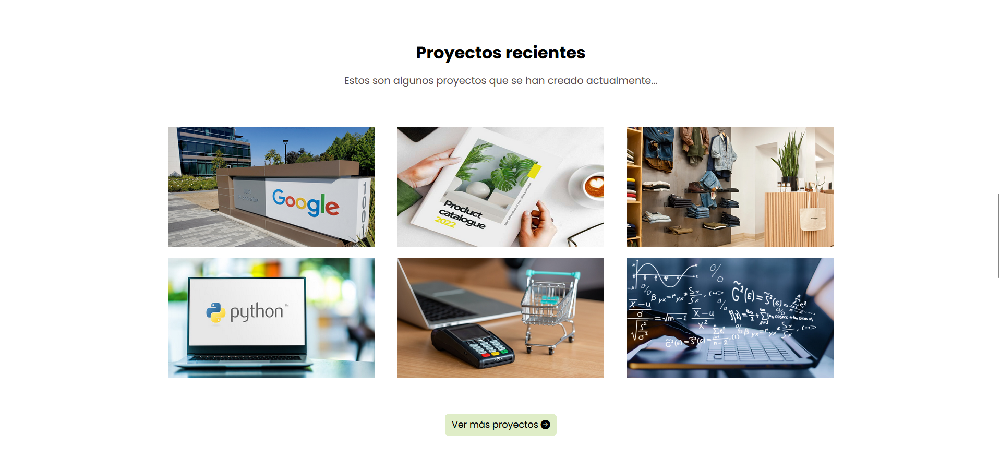
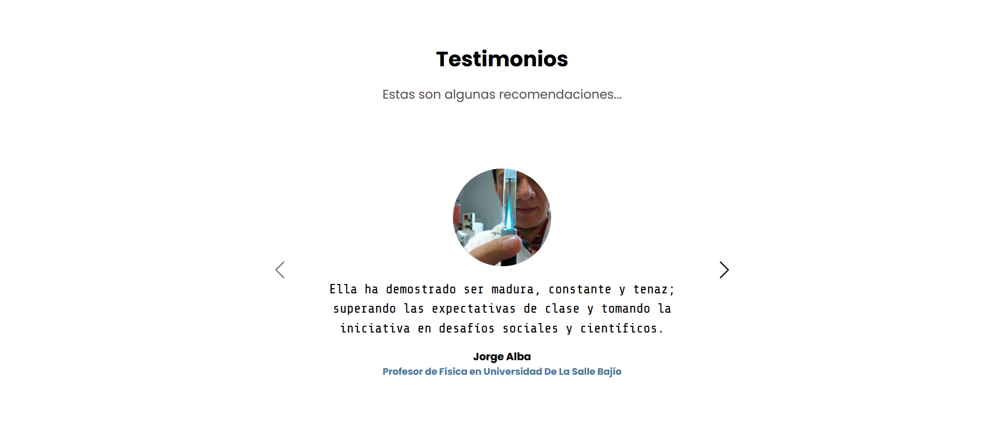
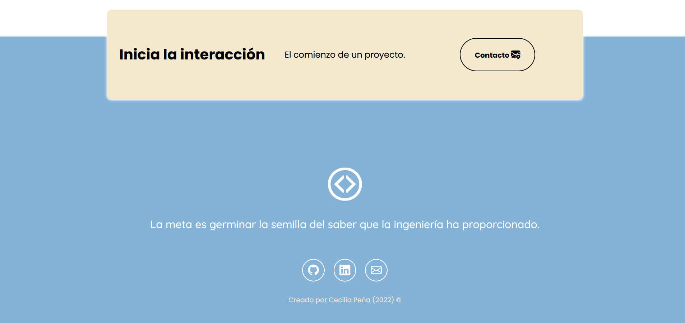

# Responsive portfolio with Bootstrap 5

This project was created in the TECHNOLOchicas PRO Bootcamp. It is a responsive web page for different-sized devices.

This page's purpose is to show the owned experience and project portfolio . It includes a brief description of the following elements: Motivation, experience, projects, articles, and contact.

It also possesses a writing JavaScript animation.

### Screenshots:

First part:

Experience:

Projects:

Attestation:

Contact:

## Technologies:

This web page was built with:

* HTML
* CSS
* JavaScript 
* Bootstrap 5

Besides, **Google Fonts** was addressed to personalize the fonts, along with **Bootstrap icons** to incorporate icons like arrows and social media logos.

